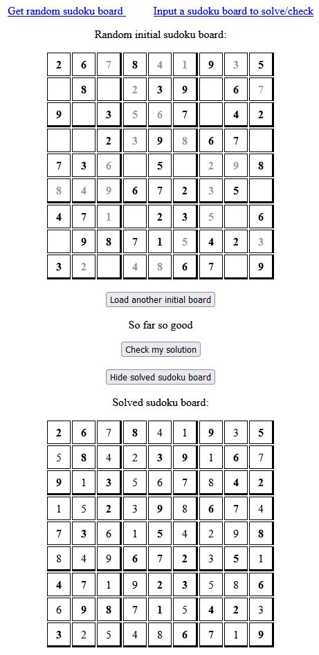

# Sudoku

A website for generating a random sudoku board that can be solved by inputing numbers from a user with a possibility to
check the current state and show a solved board calculated by the algorithm. Website also provides a place to input your
own sudoku board to check if you're doing it right and even show a solved board if possible.

You can preview the app at: http://srv08.mikr.us:30263/sudoku

or at : https://learning-sudoku-project.herokuapp.com/sudoku

## Screenshots

## Skills used

- using an API to get random initial sudoku boards to solve
- creating a backup base of initial boards to use when API request is not responding
- creating an algorithm that solves the sudoku
- creating a simple website with Flask
- added logic to make user input functionable
- using a simple .js, .css and .html file for website formatting and functions
- dockerized the Sudoku app and hosted it

### Possible improvements

- prettify the website design with more advanced html and JS
