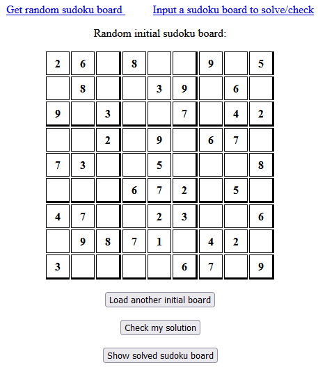

# Sudoku
A website showing a random sudoku board that can be solved by inputing numbers from a user with a possibility to show a solved board calculated by the algorithm.

You can preview the app at: https://learning-sudoku-project.herokuapp.com/

## Screenshots

## Skills used
- using a API to get random initial sudoku boards to solve
- creating a backup base of initial boards to use when API request is not responding
- creating an algorithm that solves the sudoku
- creating a simple local website with Flask
- using a simple .js and .html file for website formatting and functions

### Possible improvements
- add ability to check if user input is the correct solution
- prettify the website desing with more advanced html and JS
